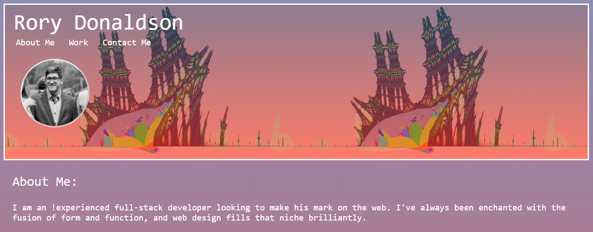

# Portfolio2.0

## About

This is my second attempt at a portfolio. It's definitely better than the first one! This one includes a few links to deployed applications and their respective github repositories, as well as contact info for yours-truly. If you want to, you can even browse through all of my zero tweets! There's also a link for hate-mail if the color scheme offends you.

## Screenshots

Screenshot #1:

## Links

- Live deploy of main on GitHub Pages: https://rorylkd.github.io/Portfolio2.0/ 

## Technology Used

- HTML
- CSS